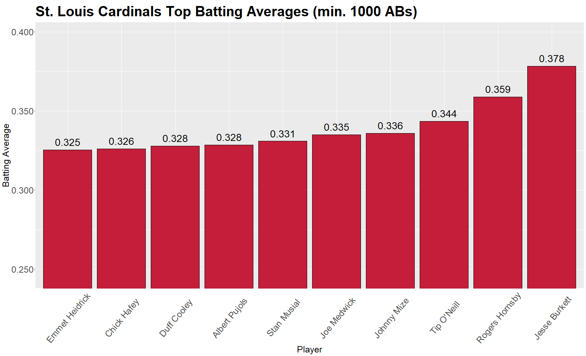

MLB Franchise Batting Leaders Pitch Deck
========================================================
author: Jerry Lakin
date: 10/2/21
autosize: true

Summary
========================================================

This app can be used to find the top historical batters by a number of 
categories for each active franchise in the MLB. 

The categories include:

- Batting average
- Home runs
- Runs batted in
- Stolen bases

To use the app, simply select the franchise that you are interested in looking 
at from the drop down menu at the top. The app will update to graph the top
10 batters by each of these statistics in the plots below.

Preparing the Data pt. 1
========================================================

Data in the app comes from the Lahman Baseball Database. <http://SeanLahman.com>.
This data is maintained in an R package, "Lahman", using a number of tables to 
represent team and player performance over the 100+ years of MLB history. The
tables that I use are listed below with summaries:

- Batting - contains batting data for each player broken down by season.
- People - contains biographical information for each player. I use this table
to get the player's full name.
- TeamsFranchises - contains information about franchises. I use this table to
get the full name of each franchise and also to determine which franchises are
still active today.

Utilizing dplyr, the data is prepared into a table called "battingSeasons" 
containing all of the columns that I need according to the code below:


```r
library(Lahman)
library(dplyr)

data(Batting)
data(People)
data(TeamsFranchises)

battingSeasons <- left_join(Batting, Teams, 
                            by = c("teamID" = "teamID", "yearID" = "yearID") ) %>%
    left_join(TeamsFranchises, by = c("franchID" = "franchID")) %>%
    left_join(People, by = c("playerID" = "playerID")) %>%
    filter(active == "Y") %>%
    select(yearID, franchID, franchName, playerID, nameFirst, nameLast, AB.x, H.x,
           HR.x, RBI, SB.x) %>%
    rename(AB = AB.x, H = H.x, HR = HR.x, SB = SB.x)

battingSeasons$nameFull <- paste(battingSeasons$nameFirst, battingSeasons$nameLast)
battingSeasons[1, ]
```

```
  yearID franchID   franchName playerID nameFirst nameLast  AB  H HR RBI SB
1   1876      CHC Chicago Cubs addybo01       Bob     Addy 142 40  0  16 NA
  nameFull
1 Bob Addy
```

Preparing the Data pt. 2
========================================================

Next the data is aggregated for each of the statistics to combine a player's 
performance for each franchise that they played for. Then tables are built 
representing each franchise's top 10 players for each statistic. The example
for batting average is shown below. 


```r
avg <- battingSeasons %>% 
    group_by(nameFull, franchName) %>% 
    summarize(ABs = sum(AB), Hs = sum(H)) 

avg$avg <- avg$Hs / avg$ABs 

avg_10 <- avg %>%
    group_by(franchName) %>%
    filter(ABs >= 1000) %>%
    slice_max(order_by = avg, n = 10) %>%
    select(nameFull, franchName, avg)

head(avg_10)
```

```
# A tibble: 6 x 3
# Groups:   franchName [1]
  nameFull         franchName             avg
  <chr>            <chr>                <dbl>
1 Luis Gonzalez    Arizona Diamondbacks 0.298
2 Paul Goldschmidt Arizona Diamondbacks 0.297
3 Danny Bautista   Arizona Diamondbacks 0.296
4 Orlando Hudson   Arizona Diamondbacks 0.294
5 David Peralta    Arizona Diamondbacks 0.291
6 Ketel Marte      Arizona Diamondbacks 0.289
```

Putting it Together in Shiny
========================================================
Finally, we put the app together using Shiny. The ui.R file accepts one input
from the user, the name of a franchise which is selected from a drop-down
menu. The server.R file uses this input to filter each of the top-10 tables
down to the desired franchise and plots the franchise's top players for each
statistic using bar plots in ggplot2. As an added touch to make the app more
appealing, I found the official team colors for each franchise and added a step
to select the franchise's official color and use it in each of the plots.


